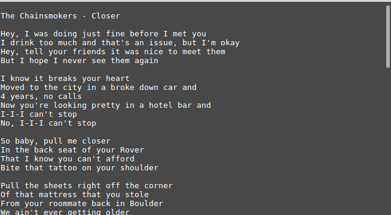

# Spotify_Lyrics
Downloads from [musixmatch](www.musixmatch.com) and displays lyrics to currently playing song in the Spotify desktop client in the Linux Terminal.

# running from source
If you want to run from source you need:

* Python 3
* pip install -r requirements.txt
* Make sure python-dbus installed in the system
* RUN AND ENJOY!

# screenshot
Tested in linux mint 19.1

# Contact me
* email: tanzimrizwan@gmail.com
